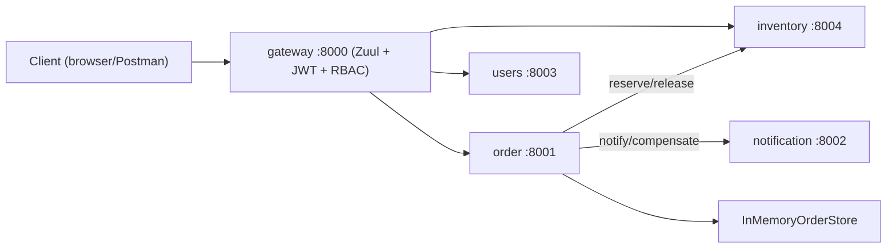

# Spring Cloud Microservices - Production-Style Saga + Gateway Demo

A distributed Spring Boot/Spring Cloud backend that models a lightweight online shop flow.
The system demonstrates API Gateway security, orchestration-based Saga transactions, service-to-service communication, and resilience patterns.

## Highlights

- Multi-service architecture with dedicated domain services (`gateway`, `order`, `inventory`, `notification`, `users`)
- Orchestrated Saga in `order` service with forward and compensation steps
- JWT-based authentication and role-based access control at gateway level
- OpenFeign clients for inter-service calls (`order` -> `inventory`, `notification`)
- Circuit breaker protection for order placement flow
- Trace propagation across service logs via Spring Cloud Sleuth
- Developer hub and OpenAPI endpoints for quick local exploration

## Architecture



### How it works (high level)

- Client obtains JWT from gateway and calls protected APIs through a single entry point.
- Gateway validates token/roles and routes requests to downstream services.
- `order` executes an orchestrated Saga for order placement.
- Saga happy path: local order creation -> inventory reservation -> notification -> complete order.
- On failures, `order` triggers compensations (release reservation, compensate notification, cancel local order).

## Engineering Challenges

- Keeping distributed order flow consistent without a global transaction manager
- Designing reliable compensation order for partial failures
- Centralizing authentication/authorization while preserving service boundaries
- Applying resilience controls without hiding business-level failure semantics
- Maintaining clear API contracts across routed and internal service endpoints

## My Contribution

- Implemented orchestrated Saga workflow in `order` with explicit rollback paths.
- Added gateway-level JWT auth and RBAC with role-scoped route access.
- Integrated OpenFeign clients for synchronous cross-service operations.
- Added resilience guardrails around order placement with circuit breaker support.
- Structured local developer experience with service-level OpenAPI access and gateway hub.

## Tech Stack

- **Backend:** Java 11, Spring Boot 2.7.1, Spring Cloud 2021.0.3
- **Cloud Components:** Zuul, OpenFeign, Sleuth
- **Resilience:** Resilience4j
- **Build:** Maven multi-module project

## Quick Start

### Prerequisites

- Java 11+
- Maven 3.8+

### Build all modules

```bash
git clone https://github.com/DiacencoDumitru/spring-cloud-microservices.git
cd spring-cloud-microservices
mvn clean install
```

### Run services (5 terminals)

```bash
cd gateway && mvn spring-boot:run
cd order && mvn spring-boot:run
cd inventory && mvn spring-boot:run
cd notification && mvn spring-boot:run
cd users && mvn spring-boot:run
```

## How to Verify

```bash
# 1) get user token
curl -X POST "http://localhost:8000/auth/token" \
  -H "Content-Type: application/json" \
  -d "{\"username\":\"user\",\"password\":\"user123\"}"

# 2) call protected user endpoint
curl "http://localhost:8000/api/gateway/me" \
  -H "Authorization: Bearer <accessToken>"

# 3) run Saga order flow
curl "http://localhost:8000/api/order/doOrder?orderName=iphone" \
  -H "Authorization: Bearer <accessToken>"
```

## Key Endpoints

- Gateway (`:8000`)
  - `POST /auth/token`
  - `GET /api/gateway/me`
  - `GET /api/gateway/admin/ping`
- Order (`routed via /api/order/**`)
  - `GET /doOrder?orderName=...`
- Inventory (`routed via /api/inventory/**`, admin role)
  - `POST /reservations`
  - `DELETE /reservations/{reservationId}`
- Users (`routed via /api/users/**`)
  - `GET /users`
  - `GET /users/{id}`
  - `GET /users?prefix=...&limit=...`

## Why This Project

This project showcases production-style concerns beyond CRUD:

- distributed transaction consistency via Saga orchestration
- centralized edge security and routing
- resilient inter-service communication
- observable and testable local microservice setup

## Project Structure

- `gateway` - API gateway, JWT auth, route-level RBAC
- `order` - Saga orchestrator and order lifecycle
- `inventory` - reservation and stock compensation endpoints
- `notification` - notification and compensation handling
- `users` - user-facing API
- `pom.xml` - root aggregator for all modules

## Author

Dumitru Diacenco, Java Backend Engineer
